<p align="center">
  
</p>

<h1 align="center">PulseDesk</h1>

<p align="center">
  <strong>Feel Your Machine. Control It Instantly.</strong>
</p>

<p align="center">
  <a href="https://github.com/Worth-Doing/pulsedesk/releases/latest"></a>
  
  
  
  
  
  
  
</p>

<p align="center">
  <a href="https://github.com/Worth-Doing/pulsedesk/releases/latest/download/PulseDesk-1.0.0.dmg">
    
  </a>
</p>

---

## What is PulseDesk?

PulseDesk is a **next-generation macOS system monitoring and control application** built entirely in **Swift + SwiftUI**. It replaces the outdated Activity Monitor with a modern, visual-first, real-time system dashboard.

This is not a passive monitoring tool. PulseDesk is an **active system control layer** that lets you understand, monitor, and optimize your Mac in real-time.

<p align="center">
  
  
  
  
</p>

---

## Features

### Dashboard — Real-Time System Overview

| Metric | Details | Update Rate |
|--------|---------|-------------|
| **CPU** | Total usage, user/system split, per-core heatmap, load average | 1s |
| **Memory** | Used/free/active/wired/compressed, pressure level, swap | 1s |
| **Network** | Upload/download speed, total transferred, dual-line graph | 2s |
| **Disk** | Storage usage ring, read/write I/O speed, I/O history | 2s |
| **GPU** | Apple Silicon utilization, VRAM usage | 2s |
| **Thermal** | Thermal state (Normal/Elevated/High/Critical), CPU temperature | 2s |

Every metric comes with:
- Live animated graph (120-point history)
- Trend indicator (up/down/stable)
- Usage bar with dynamic color coding
- Quick action access

### Process Intelligence

<p>
  
  
  
</p>

- **Intelligent scoring** — Each process scored by weighted CPU (50%), Memory (30%), and Energy (20%)
- **Runaway detection** — Processes using >80% CPU are flagged instantly
- **Search & filter** — Case-insensitive search, filter by User/System, sort by CPU/Memory/Score/Name
- **Real CPU measurement** — Delta-time based calculation, not approximation
- **System process detection** — UID-based, not PID heuristics

### Process Actions

Right-click any process for full control:

| Action | Shortcut | Signal |
|--------|----------|--------|
| Terminate | — | `SIGTERM` |
| Force Kill | — | `SIGKILL` |
| Suspend | — | `SIGSTOP` |
| Resume | — | `SIGCONT` |
| Lower Priority | — | `nice +10` |
| Raise Priority | — | `nice -5` |
| Kill Process Tree | — | Recursive `SIGTERM` |
| Copy PID | — | Clipboard |
| Copy Name | — | Clipboard |

All actions provide **toast notifications** with success/failure feedback.

### System Booster

<p>
  
  
  
</p>

One-click performance optimization with three profiles:

| Profile | CPU Threshold | Memory Threshold | Behavior |
|---------|---------------|------------------|----------|
| **Light** | 5% | 200 MB | Kill idle background processes |
| **Aggressive** | 1% | 50 MB | Aggressively free all non-essential |
| **Custom** | 3% | 100 MB | Balanced optimization |

Protected processes (Finder, Dock, WindowServer, loginwindow, etc.) are never terminated.

### Smart Suggestions

Rule-based alerts that detect:
- Runaway processes consuming excessive CPU
- Critical memory pressure with top consumers
- Elevated memory warnings

### Keyboard Shortcuts

| Shortcut | Action |
|----------|--------|
| `Cmd + 1` | Switch to Dashboard |
| `Cmd + 2` | Switch to Processes |
| `Cmd + 3` | Switch to Booster |
| `Cmd + R` | Refresh process list |

---

## Design

### Glassmorphism UI

PulseDesk uses a modern **glass morphism** design language inspired by iOS 26 and VisionOS:

- Ultra-thin material backdrops
- Depth-layered panels with subtle borders
- Spring-based animations throughout
- Hover micro-interactions on every panel
- Dynamic color coding based on usage levels

### Color System

| Color | Hex | Usage |
|-------|-----|-------|
| Blue | `#4080FF` | Primary accent, CPU |
| Purple | `#9452FF` | Memory |
| Green | `#38D17A` | GPU, healthy state |
| Cyan | `#38C7EB` | Network download |
| Orange | `#FF9433` | Upload, warnings, heavy load |
| Red | `#FF4752` | Critical, runaway, force kill |
| Yellow | `#FFD138` | Disk, elevated state |

---

## Architecture

```
PulseDesk/
├── App/
│   └── PulseDeskApp.swift              # Entry point, environment injection, menu commands
├── Models/
│   ├── SystemMetrics.swift             # CPU, Memory, Disk, Network, GPU, Thermal models
│   ├── ProcessInfo.swift               # Process model, scoring, categories
│   └── BoosterMode.swift               # Boost levels & results
├── Engine/
│   ├── MetricsEngine.swift             # Real-time system metrics (Mach/IOKit)
│   ├── ProcessEngine.swift             # Process listing, scoring, delta-time CPU
│   ├── ActionEngine.swift              # Kill/suspend/priority + smart suggestions
│   ├── ThermalEngine.swift             # Thermal state monitoring
│   └── NotificationEngine.swift        # Toast notification system
├── Views/
│   ├── ContentView.swift               # Main layout, sidebar, navigation
│   ├── Dashboard/
│   │   ├── DashboardView.swift         # Dashboard grid + status bar + suggestions
│   │   ├── CPUPanel.swift              # CPU graph + per-core heatmap
│   │   ├── MemoryPanel.swift           # Memory composition + pressure
│   │   ├── NetworkPanel.swift          # Dual upload/download graph
│   │   ├── DiskPanel.swift             # Usage ring + I/O graph
│   │   └── GPUPanel.swift              # Apple Silicon GPU metrics
│   ├── Process/
│   │   ├── ProcessListView.swift       # Searchable list + context menus
│   │   └── ProcessCardView.swift       # Process cards + hover actions
│   ├── Booster/
│   │   └── BoosterView.swift           # Optimization profiles + activation
│   └── Components/
│       ├── LiveGraph.swift             # Bezier curve real-time graphs
│       └── GlassCard.swift             # Design system components + toasts
└── Utils/
    └── Extensions.swift                # Colors, animations, formatters
```

### System APIs Used

| API | Purpose |
|-----|---------|
| `host_statistics` | Overall CPU usage |
| `host_processor_info` | Real per-core CPU |
| `vm_statistics64` | Memory breakdown |
| `proc_listallpids` / `proc_pidinfo` | Process enumeration |
| `IOKit` (`IOBlockStorageDriver`) | Disk I/O metrics |
| `IOKit` (`AGXAccelerator`) | GPU utilization + VRAM |
| `ifaddrs` | Network interface stats |
| `ProcessInfo.thermalState` | Thermal monitoring |
| `sysctl` (`KERN_BOOTTIME`) | System uptime |

---

## Requirements

<p>
  
  
  
</p>

- **macOS 14.0** (Sonoma) or later
- **Apple Silicon** (M1/M2/M3/M4) recommended (Intel compatible but GPU metrics limited)
- No Xcode required — builds with Swift CLI toolchain

---

## Installation

### Download (Recommended)

<a href="https://github.com/Worth-Doing/pulsedesk/releases/latest/download/PulseDesk-1.0.0.dmg">
  
</a>

1. Download the `.dmg` file
2. Open the DMG
3. Drag **PulseDesk** to **Applications**
4. Launch from Applications

> The app is **signed and notarized** by Apple — no Gatekeeper warnings.

### Build from Source

```bash
# Clone
git clone https://github.com/Worth-Doing/pulsedesk.git
cd pulsedesk

# Build (debug)
swift build

# Run
.build/debug/PulseDesk

# Build (release)
swift build -c release
.build/release/PulseDesk
```

---

## Performance

PulseDesk is designed to be lightweight:

| Metric | Target |
|--------|--------|
| CPU Usage | < 3% |
| Memory | < 40 MB |
| Binary Size | ~1.5 MB |
| DMG Size | ~2.3 MB |
| Launch Time | < 0.5s |

---

## Tech Stack

<p>
  
  
  
  
  
  
</p>

- **Swift only** — no Objective-C, no C bridges
- **SwiftUI only** — no AppKit views
- **No Xcode dependency** — builds via `swift build`
- **No Electron** — pure native macOS
- **No third-party dependencies** — zero external packages

---

## Roadmap

- [ ] Menu bar extra (compact floating widget)
- [ ] Multi-window support
- [ ] Settings/preferences panel
- [ ] Metric export (CSV/JSON)
- [ ] Custom boost profiles
- [ ] Plugin system
- [ ] Multi-device monitoring
- [ ] CLI tool (`pulsedesk stats`, `pulsedesk boost`)

---

## Contributing

Contributions are welcome. Please open an issue first to discuss what you'd like to change.

```bash
# Fork the repo
# Create your feature branch
git checkout -b feature/amazing-feature

# Commit your changes
git commit -m "Add amazing feature"

# Push to the branch
git push origin feature/amazing-feature

# Open a Pull Request
```

---

## License

MIT License — see [LICENSE](LICENSE) for details.

---

<p align="center">
  <strong>PulseDesk</strong> — What Activity Monitor should have been if it was designed in 2026.
</p>

<p align="center">
  <sub>Built with Swift + SwiftUI. No Xcode required. Signed & Notarized by Apple.</sub>
</p>
